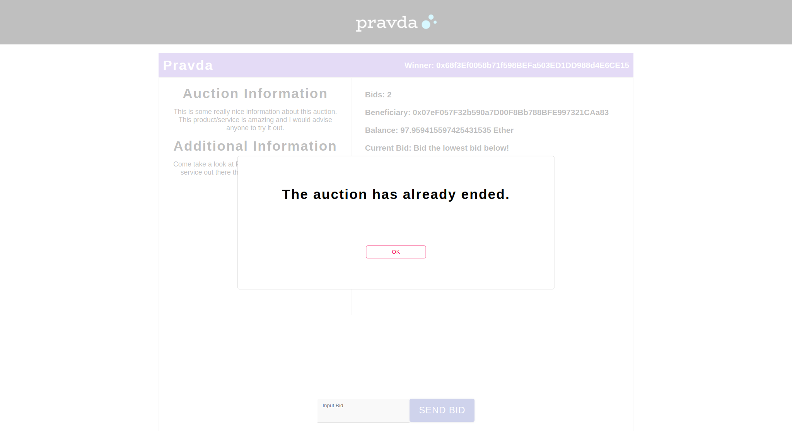

# Pravda
Welcome to the Pravda repository! We use React on the frontend, and on the backend we use Node.js and MongoDB. The commands below should be run in a terminal. On Windows, you can use an existing terminal prompt like Command Prompt or PowerShell or install [Git Bash](https://gitforwindows.org/), and on Mac or Linux, you can simply own the terminal application.

## Dependencies
Make sure you clone the repo with:
```c
git clone https://github.com/ewc340/Pravda.git
```
Make sure you have [node](https://nodejs.org/en/download/) and [yarn](https://classic.yarnpkg.com/en/docs/install).
Then change into the `app` and `server` directories and run `yarn install` to install the dependencies for each respective directory.

In addition, make sure you have [MongoDB](https://docs.mongodb.com/guides/server/install/) installed as well. Then run the following commands from the root directory of the Pravda folder to make a local database you can store data on.

```c
cd server
mkdir data/db
```

Finally, to test locally, make sure to use Ganache blockchain which you can install [here](https://www.trufflesuite.com/ganache).

## Running the application
To run the application, follow the instructions below to start the database connection, Ganache blockchain, server, and the app.

### Running MongoDB 
After you have installed MongoDB from above, from the `server` directory, run the following to have MongoDB up and running:

```c
mongod --dbpath  "data/db"
```
### Running the Ganache blockchain
Now open up the Ganache application, and create a new workspace. You should now have 10 accounts that you can play with, as shown below:

 
Go to the settings (top right gear icon) and ensure the `PORT NUMBER` under the server category is set to 8545. 

Now go back to the main page and select an address. This address will be responsible for deploying the smart contracts when server requests come in to create a new auction. Follow this path in the repository:
```c
server/utils/auctions/getAuctionInformation/contractDeployerAddress
```
and replace the current address with the address selected.

### Starting the server
In a separate terminal, start the server by running the following commands:

```
cd server
yarn serve
```
If the server starts successfully, then you should see the following:
```c
Server is listening on 8000
Connected to Mongo via Mongoose
```
**Make sure you see both messages or the application will not run properly.**

### Running the React application
In a separate terminal, start the application by changing into the `app` directory, and running `yarn start`. This should open the application in a browser window.

## Usage
Below are some screenshots and descriptions of the usage of the application.

|   |  |
|:---:|:---:|
| Dashboard showcasing the live auctions and ability to add a new item to auction. | Adding a new item modal |

|   |  |
|:---:|:---:|
| Bid screen | Select a sender address (this is from the list of Ganache accounts) |

|   |  |
|:---:|:---:|
| If your bid was successful, then you should see the popup. | If your bid either wasn't the lowest price or another error happened in the trasaction, then the above modal will pop up. |

|   |  |
|:---:|:---:|
| Once the countdown timer is up, then the winner will be shown | Once the auction ends and a user tries to bid, then it won't be possible. |

## Future work
Future work will involve:
1. Building a robust procurement system platform that can scale to more users
2. Updating the UI/UX experience 
3. Improve security and anonymity on the platform
4. Maintaining stronger smart contract logic
5. Deploying smart contract on the Ethereum Mainnet or creating a private blockchain to host auctions